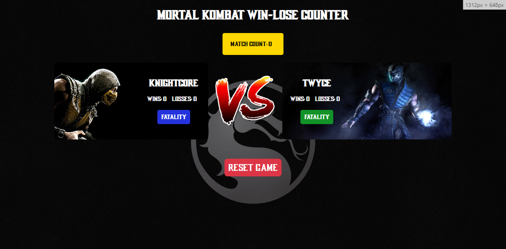

# Mortal Kombat Win-Lose Counter

## Description

This is a simple web application for tracking wins, losses, and match counts between two players in a Mortal Kombat game. It includes a clean and ~~responsive~~ design (yet to be done) with buttons for recording match results and resetting the game.

## Features

- Record wins and losses for Player 1 and Player 2.
- Display match count.
- ~~Responsive design for a better user experience.~~(Yet to be done)

## Usage

1. Open `index.html` in a web browser.
2. Enter player names when prompted.
3. Click on the "FATALITY" Button to record match results.
4. Use the "Reset Game" button to reset the match results.

## Screenshots




## Installation

Clone the repository:

```bash
git clone https://github.com/your-username/mortal-kombat-counter.git
cd mortal-kombat-counter
```
## License
This project is licensed under the MIT License.

## Acknowledgments
Inspired by Mortal Kombat game statistics.
Built with HTML, CSS, and JavaScript.
